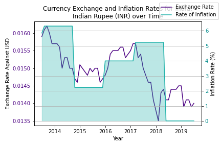

# Inflate the Rate

## Project members:
    Kate Spitzer (Lead Developer)
    Fernando Flores (Lead Developer)
    Luan Dinh
    Amir Vazquez

## Project Description

This project attempts to find a correlation exchange rate and inflation. We looked at a few countries currencies vs the US dollar. And compared the FX rate to the countrys inflation. This project is a two part. One the analysis and technical design and the second part is a presentation of the analysis to the class.

In this example we can see an output of the Indian Rupee (INR) and India Rate of Inflation. 

## Data Set
To acomplish this project we used the following API's [Alpha Vantage API](https://www.alphavantage.co/query?function=FX_MONTHLY), the [Stats Bureau API](https://www.statbureau.org/calculate-inflation-rate-json). 

## Analysis
Country data set is available in the config.py here you can find the list of contries and their currency.

The exchange rate notebook contains the exchage rate API code pull, data clean up and analysis by country. This data is pulled a the month level for the ranges "2014-12 to "2019-12".

The Inflation notebook contains the inflation rate api code, data clean up and analysis by country. The data from this API is only at the year level. Therefore, in order to compare the inflation vs exchange rate we applied a more ticks to have a full year (1-12 months.)

The comparison between the two datasets can be found in the Exchange Inflation_plots notebook. 

## Technical Requirements
The technical requirements for Project 1 are as follows.
 - Use Pandas to clean and format your data set(s)
 - Create a Jupyter Notebook describing the data exploration and cleanup process
 - Create a Jupyter Notebook illustrating the final data analysis
 - Use Matplotlib to create a total of 6-8 visualizations of your data (ideally, at least 2 per "question" you ask of your data)
 - Save PNG images of your visualizations to distribute to the class and instructional team, and for inclusion in your presentation
 - Optionally, use at least one API, if you can find an API with data pertinent to your primary research questions
 - Create a write-up summarizing your major findings. This should include a heading for each "question" you asked of your data, and under each heading, a short description of what you found and any relevant plots.

